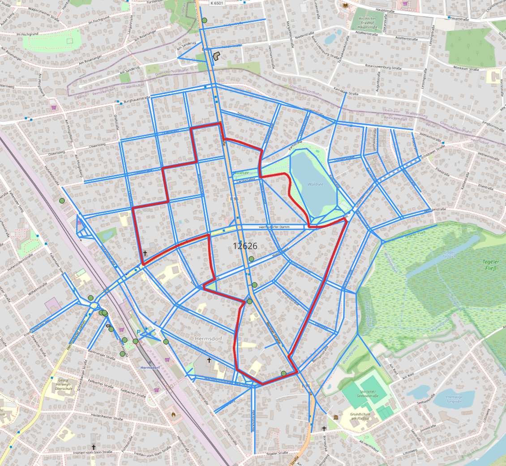

# POIs in walk in district
Generate GeoJSON file of POIs and street network with in walking distance from ditrict center

**What this code do?**
- Creates street network subgraphs (sub_g) for each district from the full area network
- Calculates walkable routes from district centers
- Extracts POIs located near these walking routes
- Exports results as GeoJSON files

**Required python packages**

[shapely](https://github.com/shapely/shapely)\
[geopandas](https://github.com/geopandas/geopandas)\
[netwworkx](https://github.com/networkx/networkx)\
[osmnx](https://github.com/gboeing/osmnx)

**Screenshot of data visualization**

Data visualization of generated file on QGIS

